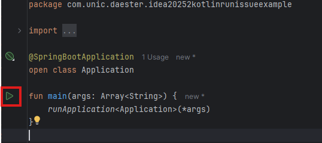

# Showcase Jetbrains IntelliJ IDEA 2025.2 issue with Kotlin and WSL2

With the new Jetbrains IntelliJ IDEA 2025.2, there should be no need to connect to WSL through the Gateway. All things (terminal, context, execution) should be run within the distribution.

But the combination of Maven and Kotlin does not work. This project shows what is going wrong in a simple, reproducible way.

## Expected result

- Executing Maven Tasks should work
- Run the application through IntelliJ IDEA Run should work

## Actual result

- ✅ Executing Maven Tasks should work
- 💣 Run the application through IntelliJ IDEA Run should work

```text
\\wsl.localhost\Ubuntu-24.04\home\wsl\Projects\2025.2-kotlin-run-issue\2025.2-kotlin-runissue-example\src\main\kotlin\com\unic\daester\idea20252kotlinrunissueexample\Application.kt:10:5
Kotlin: Cannot inline bytecode built with JVM target 17 into bytecode that is being built with JVM target 1.8. Please specify proper '-jvm-target' option
```

## Steps

1. Have Windows 11 and WSL2 up and configured
2. Have a WSL distribution (as an example, Ubuntu 2024.4)
3. Have JDK 17+ on the WSL distribution set up
4. Clone the repository into a folder into your WSL via the shared folder like `\\wsl.localhost\Ubuntu-24.04\......`
5. Open the repository
6. Load maven dependencies
7. Run the application over the run configurations <br /><br /><br />or on the file `Application.kt` within the editor <br /><br />
